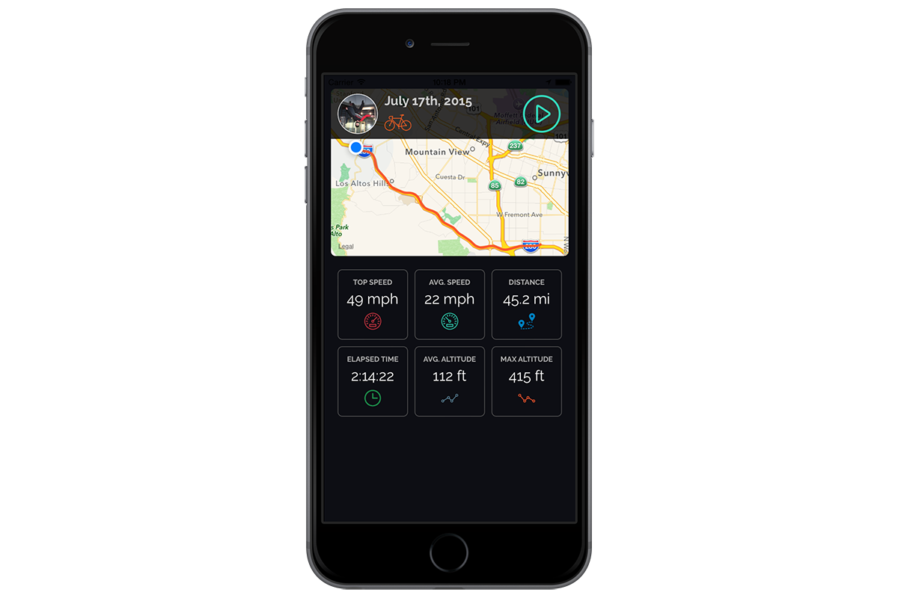

##Follower *beta*

### Track trip distance, speed, altitude, and duration like a boss.




## Getting started

- Add `pod 'Follower'` to your podfile, and run `pod install`.
- Ensure your app is set up for iOS 8 location services, i.e. add your `NSLocationWhenInUseUsageDescription` to your info.plist.

## How easy is it to use?

Perhaps you're a fitness app, and you want to track the route information for a user on their daily mountain ride...

```objective-c
// Create your follower, and tell it to start route tracking.
self.follower = [Follower new];
[self.follower beginRouteTracking];
.
.
.
// Maybe they want to pause their workout so they can stop for a drink...
[self.follower pauseRouteTracking]
.
.
// Ready to get back to it!
[self.follower resumeRouteTracking]
.
.
// some time later...
[self.follower endRouteTracking];
```

That was easy... Now what?

## Map Polyline / Region

```objective-c
[self.mapView addOverlay:self.follower.routePolyline];
[self.mapView setRegion:self.follower.routeRegion animated:YES];
```

## Time

```objective-c
// Total time spent tracking route - not including time paused.
[self.follower routeDurationString]; // "02:30:00"
[self.follower routeDurationWithUnit:TimeUnitSeconds]; // 9000.0
[self.follower routeDurationWithUnit:TimeUnitMinutes]; // 150.0
[self.follower routeDurationWithUnit:TimeUnitHours]; // 2.5
```

## Speed

```objective-c
[self.follower averageSpeedWithUnit:SpeedUnitMetersPerSecond]; // 26.8224...
[self.follower averageSpeedWithUnit:SpeedUnitKilometersPerHour]; // 96.560...
[self.follower averageSpeedWithUnit:SpeedUnitMilesPerHour]; // 60.0

// Same speed options above
[self.follower topSpeedWithUnit:...];
```

## Distance

```objective-c
[self.follower totalDistanceWithUnit:DistanceUnitMeters]; // 1000.0
[self.follower totalDistanceWithUnit:DistanceUnitKilometers]; // 1.0
[self.follower totalDistanceWithUnit:DistanceUnitFeet]; // 3280.8399...
[self.follower totalDistanceWithUnit:DistanceUnitMiles]; // .6213...
```

## Altitude

```objective-c
// Same unit options as above
[self.follower averageAltitudeWithUnit:...];
[self.follower minimumAltitudeWithUnit:...];
[self.follower maximumAltitudeWithUnit:...];
```

## Realtime Information

Implement the following (optional) `FollowerDelegate` method, and set yourself as the delegate for your Follower to get updates when we do, rather than waiting for the trip to be done. *NOTE:* Region and polyline information is only available after route tracking has been ended.

```objective-c
- (void)followerDidUpdate:(Follower *)follower {
	// Get all of the same above information here...
}
```

## License

The source is made available under the MIT license.
